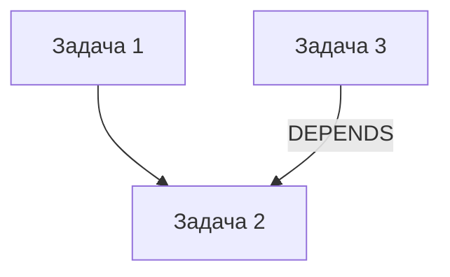

[](https://deepwiki.com/KDragonic/NoteMCP)

# 📌 NoteMCP — Интеллектуальная Система Управления Задачами

> 🚀 Сервер MCP для создания связанных задач с мощной графовой визуализацией и двойным интерфейсом (MCP + REST API)

---

## 🔍 Основные Возможности

| Функция | Описание |
|--------|----------|
| **🧠 Управление Задачами** | CRUD операции с поддержкой группировки и связей |
| **🔗 Система Связей** | Создание типизированных отношений между задачами |
| **📊 Графовая Визуализация** | Автоматическая генерация Mermaid-диаграмм с цветовой кодировкой |
| **📦 Группировка Проектов** | Изолированные рабочие пространства через систему групп |
| **🔌 Двойной Интерфейс** | Поддержка MCP протокола и REST API в одном сервере |

---

## 🛠️ Технологический Стек

<div align="center">
  
</div>

| Уровень | Технологии |
|--------|------------|
| **Backend** | Node.js + Express |
| **База Данных** | SQLite3 через better-sqlite3 |
| **Протоколы** | @modelcontextprotocol/sdk |
| **Визуализация** | Mermaid CLI + Puppeteer |
| **Валидация** | Zod схемы |

---

## 🧱 Архитектура

```
+-------------------+
|   MCP/STDIO API   |
+-------------------+
|   REST API        |
+-------------------+
|   Бизнес-Логика   |
| (CRUD + Relations) |
+-------------------+
|   База Данных     |
| (tasks + relations)|
+-------------------+
```

---

## 🚀 Быстрый Старт

```bash
# Установка зависимостей
npm install

# Запуск сервера
npm start

# Режим разработки
npm run dev
```

---

## 📦 MCP Инструменты

```typescript
interface MCPTools {
  getTasks(): Task[]
  createTask(data: TaskCreate): Task
  updateTasks(updates: TaskUpdate[]): Task[]
  deleteTask(id: string): void
  addTaskRelations(links: Relation[]): void
  getTasksGraph(): MermaidGraph
}
```

---

## 🗃️ Структура Данных

### Задача
| Поле | Тип | Описание |
|------|-----|----------|
| `id` | string | Уникальный идентификатор |
| `title` | string | Обязательное поле |
| `status` | enum | "ожидает", "в процессе", "завершена" |
| `priority` | number | 1-5 |
| `group_name` | string | Пространство проекта |

### Связь
| Поле | Тип | Описание |
|------|-----|----------|
| `source_task_id` | string | ID исходной задачи |
| `target_task_id` | string | ID целевой задачи |
| `relation_type` | string | Тип связи |

---

## 🖼️ Графовая Визуализация

### Цветовая Кодировка
🟢 Завершённые задачи • 🔵 В процессе • 🟡 Ожидающие
**Толщина границы** = Приоритет задачи



---

## 📜 Лицензия

ISC License — [Полный текст](LICENSE)
```

---

### 📸 Пример Визуализации


---

### 📈 Статистика

[](https://github.com/KDragonic/NoteMCP)
[](https://github.com/KDragonic/NoteMCP/issues)